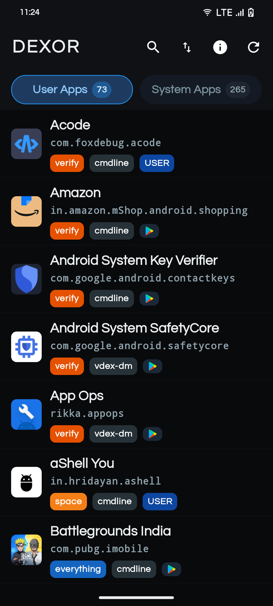
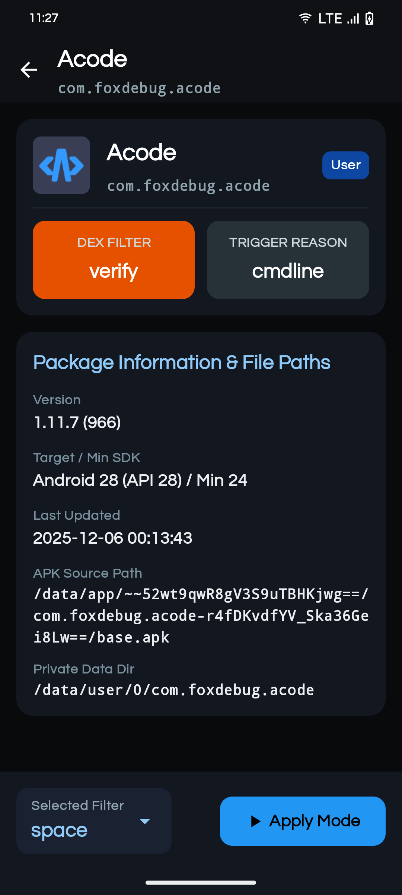
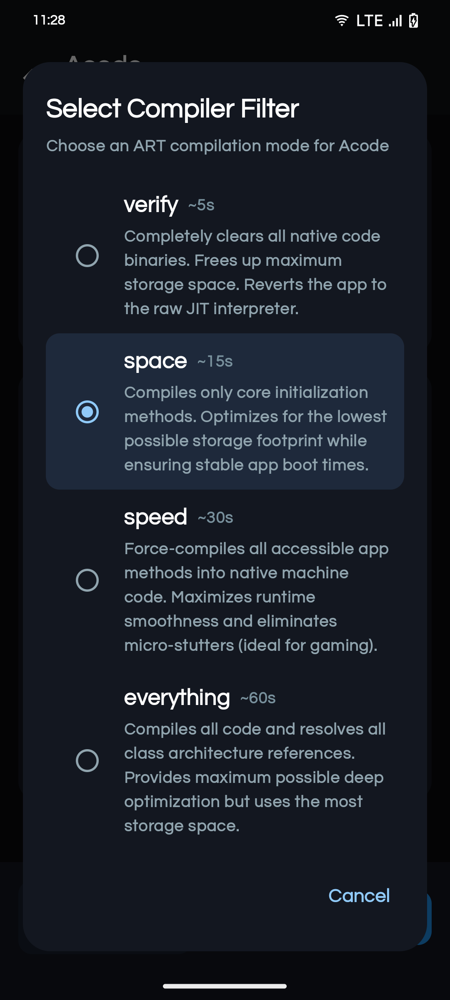

# Dexor

<p align="center">
  
</p>

<h3 align="center">Unified DEX2OAT Runtime & Ahead-Of-Time (AOT) Bytecode Manager for Android</h3>

<p align="center">
  <a href="https://github.com/DeveshTone/Dexor/releases"></a>
  <a href="https://developer.android.com"></a>
  <a href="https://github.com/RikkaApps/Shizuku"></a>
  <a href="LICENSE"></a>
  
  
</p>

---

## Overview

**Dexor** is an advanced, non-root Android application ahead-of-time (AOT) bytecode compilation and dexopt utility. Powered by the Android Runtime (`dex2oat`) and [Shizuku](https://github.com/RikkaApps/Shizuku), Dexor enables users and developers to inspect deep runtime compilation statuses across user and system applications, execute on-demand or batch DEX optimizations, eliminate JIT warmup latency, and reclaim device storage without root privileges.

Designed with a clean, dark Material 3 aesthetic, Dexor provides a modern, responsive environment with zero telemetry, zero advertisements, and strict privacy by design.

---

## Screenshots

<p align="center">
  
  
  
</p>

---

## Key Features

- **Non-Root Elevated Compilation:** Harnesses Shizuku IPC to trigger Android's native `cmd package compile` endpoints safely without rooting your device.
- **Deep Dexopt State Inspection:** Zero-allocation linear parser inspects compiler filters (`speed`, `space`, `verify`, etc.), compilation reasons (`cmdline`, `install`, `bg-dexopt`), and primary/split APK statuses.
- **Batch Processing:** Select multiple user or system applications and compile them in an automated, sequential pipeline with live progress tracking.
- **Instant Search & Multi-Criteria Sorting:** Fast search across app names and package IDs, with sorting by Name, DEX Status, or Installation Source offloaded to background worker threads.
- **Built-in System Diagnostics:** Live inspection of connected device hardware, Android OS release, SDK API level, and CPU architecture (ABIs).
- **100% Offline & Private:** `android.permission.INTERNET` is completely absent from the manifest. Dexor physically cannot make network requests or transmit analytics.

---

## Compilation Modes

Dexor interfaces directly with the Android Runtime (`dex2oat`). Select the compiler filter that best suits your performance and storage balance:

| Mode | Filter | Description | Storage Footprint | Typical Duration |
| :--- | :--- | :--- | :---: | :---: |
| **Speed** | `speed` | Force-compiles all accessible app bytecode methods into native machine code. Eliminates JIT compilation stutter and maximizes runtime execution speed (recommended for games and high-throughput apps). | High | ~30s / app |
| **Space** | `space` | Compiles core application initialization and entry points. Balances disk storage conservation with stable app launch responsiveness. | Low–Medium | ~15s / app |
| **Verify** | `verify` | Validates DEX bytecode structure and dependencies without generating native AOT machine code. Clears AOT compilation cache to reclaim maximum storage space. | Minimum | ~5s / app |
| **Everything** | `everything` | Exhaustively compiles every method, class, and auxiliary DEX file unconditionally. Guarantees 100% native execution across all application code. | Maximum | ~60s / app |

---

## Performance & Architecture

Dexor is engineered with strict mobile performance principles:

- **R8 Full ProGuard Minification:** Full R8 obfuscation and resource shrinking reduce the release binary from 21.5 MB down to **3.29 MB** (an 85% size reduction).
- **Asynchronous Coroutine Pipeline:** List filtering, searching, and multi-criteria sorting are offloaded from the UI thread to `Dispatchers.Default`.
- **Zero-Allocation Dumpsys Parsing:** Optimized single-pass substring parsing for `dumpsys package dexopt` eliminates object allocations during package scans.
- **Smart WebP Disk Cache:** Lossy WebP (85% quality) caching eliminates repeated `PackageManager` IPC calls and prevents UI micro-stutters during list scrolling.
- **Room v4 Indexed Persistence:** Caches application metadata and package names locally for instant cold boots.

---

## Requirements

- **Android Version:** Android 9.0 to Android 15 (API levels 28 – 35).
- **Privilege Manager:** [Shizuku](https://github.com/RikkaApps/Shizuku) (v13.1.5 or newer) running via Wireless Debugging, ADB, or Root.

> [!NOTE]
> Without Shizuku authorization, Dexor operates in a read-only inspection mode and cannot trigger elevated compilation commands.

---

## Building from Source

### Prerequisites
- Android Studio Iguana (or newer) or standalone Gradle 8.4+
- JDK 17 (Java Development Kit 17)
- Android SDK Platform 34 & Build Tools 34.0.0

### Build Steps
```bash
# Clone the repository
git clone https://github.com/DeveshTone/Dexor.git
cd Dexor

# Assemble release APK
./gradlew assembleRelease
```
The optimized release APK will be generated at:
`app/build/outputs/apk/release/app-release.apk`

---

## Security & Privacy

Dexor respects user privacy above all else:
- **No Internet Access:** The network permission `android.permission.INTERNET` is not requested in the `AndroidManifest.xml`.
- **Zero Telemetry:** No crash reporting SDKs (Firebase, Bugsnag), no tracking frameworks, and no ad libraries.
- **System Integrity:** Dexor executes standard Android system commands through Shizuku without altering read-only system partitions or kernel parameters.

---

## Credits & Acknowledgements

- **[Shizuku](https://github.com/RikkaApps/Shizuku)** by [RikkaApps](https://github.com/RikkaApps) — Elevated Android system APIs without root.
- **[Jetpack Compose](https://developer.android.com/jetpack/compose)** & AndroidX by Google LLC.
- **[Room Persistence](https://developer.android.com/training/data-storage/room)** by Google LLC.
- **[Coil](https://coil-kt.github.io/coil/)** by Coil Contributors — Async image loader for Android.
- Developed with pair-engineering assistance from **Google Gemini** and **Antigravity**.

---

## License

This project is open source and available under the [MIT License](LICENSE).

```
Copyright (c) 2026 DeveshTone
```
